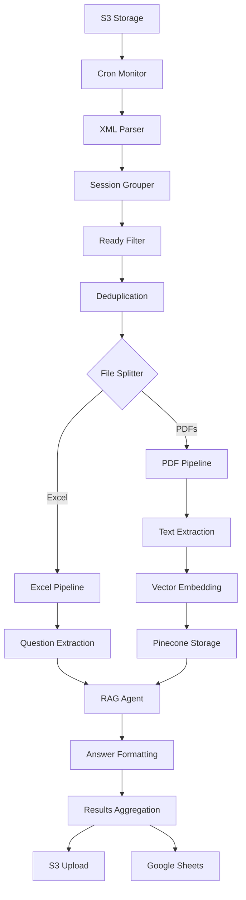

# Audit-n8n-s3-next

## 🚀 Project Overview

Audit-n8n-s3-next is an intelligent document processing and Q&A automation workflow built with n8n. The system automatically processes audit-related documents and questionnaires, creates searchable knowledge bases, and generates comprehensive Q&A reports using advanced RAG (Retrieval-Augmented Generation) technology.

## 📋 Project Scope

This workflow enables organizations to:
- **Automate Document Processing**: Process PDF documents and Excel questionnaires from S3 storage
- **Create Knowledge Bases**: Generate vector embeddings for intelligent document search
- **Generate Q&A Reports**: Automatically answer questionnaire items using processed documents
- **Multi-tenant Support**: Handle multiple organizations, users, and sessions simultaneously
- **Export Results**: Generate Excel reports and upload to S3 and Google Sheets

### Key Features
- ✅ **Multi-user isolation**: Complete data separation between organizations and users
- ✅ **Intelligent deduplication**: Prevents reprocessing of already embedded documents
- ✅ **Real-time monitoring**: Cron-based polling for new documents
- ✅ **Comprehensive logging**: Detailed processing status and error tracking
- ✅ **Multiple output formats**: Excel, CSV, and Google Sheets integration
- ✅ **Advanced RAG processing**: Context-aware question answering using vector databases

## 🏗️ System Architecture

### Core Components



### Technology Stack

- **Orchestration**: n8n workflow automation
- **Vector Database**: Pinecone for document embeddings
- **LLM**: Google Gemini 2.0 Flash for Q&A generation
- **Embeddings**: Cohere embedding model
- **Storage**: AWS S3 for file management
- **Reporting**: Google Sheets API for real-time results
- **Document Processing**: PDF text extraction and Excel parsing

### Data Flow Architecture

1. **Document Ingestion**: S3 bucket monitoring (`uploadsfromchatbot`)
2. **Session Organization**: Files grouped by `org/user/session` structure
3. **Dual Processing Pipelines**:
   - **PDF Pipeline**: Text extraction → Chunking → Vector embedding → Storage
   - **Excel Pipeline**: Question extraction → RAG processing → Answer generation
4. **Results Consolidation**: Multi-format output generation and distribution

## 🚦 Getting Started

### Prerequisites

Before deploying this workflow, ensure you have:

#### Required Services
- **n8n instance** (self-hosted or cloud)
- **AWS S3 bucket** with appropriate IAM permissions
- **Pinecone account** with vector database
- **Cohere API key** for embeddings
- **Google Cloud Project** with Gemini API access
- **Google Sheets API** credentials (optional)

#### Required n8n Nodes
The workflow uses several specialized n8n nodes:
- `@n8n/n8n-nodes-langchain` (LangChain integration)
- `n8n-nodes-pdf-excel.pdfExcelProcessor` (PDF processing)
- Standard n8n nodes (HTTP, S3, Code, etc.)

### Installation Steps

1. **Clone the Repository**
   ```bash
   git clone https://github.com/yourusername/audit-n8n-s3-next.git
   cd audit-n8n-s3-next
   ```

2. **Import Workflow**
   - Open your n8n instance
   - Navigate to **Workflows** → **Import from File**
   - Upload `AuditN8NWorkflow.json`

3. **Configure Credentials**
   Set up the following credential types in n8n:

   #### AWS S3 Credentials
   ```
   Credential Type: AWS
   Access Key ID: [your-access-key]
   Secret Access Key: [your-secret-key]
   Region: eu-west-2 (or your bucket region)
   ```

   #### Pinecone Credentials
   ```
   Credential Type: Pinecone API
   API Key: [your-pinecone-api-key]
   Environment: [your-pinecone-environment]
   ```

   #### Cohere Credentials
   ```
   Credential Type: Cohere API
   API Key: [your-cohere-api-key]
   ```

   #### Google Gemini Credentials
   ```
   Credential Type: Google PaLM API
   API Key: [your-google-api-key]
   ```

   #### Google Sheets (Optional)
   ```
   Credential Type: Google Sheets OAuth2 API
   [Complete OAuth2 setup process]
   ```

4. **Configure Workflow Parameters**
   
   > 📝 **Important**: Update these key settings before running the workflow
   
   | Parameter | Description | Action Required |
   |-----------|-------------|-----------------|
   | **S3 Bucket Name** | Target bucket for file storage | Update all S3 nodes to use your bucket name |
   | **Pinecone Index** | Vector database index | Ensure index name matches your Pinecone setup |
   | **Cron Schedule** | Monitoring frequency | Adjust timing (default: every 5 seconds) |

### 📁 File Structure Requirements

Your S3 bucket **must** follow this exact hierarchical structure:

```bash
📦 uploadsfromchatbot/
├── 🏢 org1/
│   ├── 👤 user1/
│   │   ├── 📊 session001/
│   │   │   ├── 📄 documents/
│   │   │   │   ├── 📄 audit_report.pdf
│   │   │   │   └── 📄 financial_statements.pdf
│   │   │   ├── 📋 questionnaires/
│   │   │   │   └── 📊 compliance_questions.xlsx
│   │   │   └── 📈 results/
│   │   │       └── 📊 [generated files]
│   │   └── 📊 session002/
│   │       ├── 📄 documents/
│   │       └── 📋 questionnaires/
│   └── 👤 user2/
│       └── 📊 session003/
└── 🏢 org2/
    └── 👤 user3/
        └── 📊 session004/
```

> ⚠️ **Critical**: Sessions are only processed when **both** `documents/` and `questionnaires/` folders contain files

### 📊 Excel Questionnaire Format

Questionnaires must be `.xlsx` files with this specific structure:

```
📋 Questionnaire Structure Requirements:

✅ File Type: .xlsx (Excel format)
✅ Location: /questionnaires/ folder
✅ Headers: Module names in columns
✅ Content: Questions in rows
```


## ⚡ Usage

### Starting the Workflow

1. **Activate the Workflow** in n8n
2. The cron trigger will automatically start monitoring your S3 bucket
3. Upload files to S3 following the required structure
4. Monitor execution in the n8n interface

### Processing Flow

1. **File Upload**: Place PDF documents in `/documents/` and Excel questionnaires in `/questionnaires/`
2. **Automatic Detection**: Workflow detects new sessions with both file types
3. **PDF Processing**: Documents are extracted, chunked, and embedded
4. **Q&A Generation**: Questions are answered using the embedded knowledge
5. **Results Export**: Answers are formatted and exported to multiple destinations

### Output Formats

The workflow generates several output files:
- **Excel Report**: `org_user_session_timestamp.xlsx`
- **CSV Export**: `org_user_session_timestamp.csv`
- **JSON Summary**: `summary_org_user_session_timestamp.json`
- **Completion Status**: `completion_org_user_session.txt`
- **Google Sheets**: Live collaborative spreadsheet (if configured)

## 🔧 Configuration

### 🔧 Configuration Options

#### ⏰ Cron Monitoring Settings
```javascript
// 📍 Location: "Cron Trigger - Every 5 Seconds" node
// ⚙️ Adjust monitoring frequency based on your needs

schedule: "*/5 * * * * *"   // ⚡ Every 5 seconds (development)
schedule: "*/30 * * * * *"  // 🔄 Every 30 seconds (production)
schedule: "0 */5 * * * *"   // ⏱️ Every 5 minutes (low traffic)
```

#### 🧠 Vector Database Configuration
```javascript
// 📍 Location: "Text Splitter" node
// 📊 Optimize for your document types

{
  chunkSize: 4000,          // 📄 Characters per chunk
  chunkOverlap: 400,        // 🔄 Overlap between chunks
  separators: ["\n\n", "\n", " ", ""]  // 📝 Text splitting logic
}
```

#### 🎯 RAG Processing Parameters
```javascript
// 📍 Location: "Session Knowledge Base (Pinecone)" node
// 🔍 Fine-tune retrieval accuracy

{
  topK: 10,                 // 📚 Number of relevant chunks to retrieve
  scoreThreshold: 0.7,      // 📈 Minimum relevance score
  includeMetadata: true,    // 📋 Include document metadata
  includeValues: false      // 🔢 Include embedding vectors
}
```

#### ⚡ Performance & Scaling
```javascript
// 📍 Location: "S3 objects and group them by session" node
// 🚀 Adjust for your scale requirements

const config = {
  MAX_SESSIONS_PER_BATCH: 50,      // 📊 Sessions processed per run
  MAX_FILES_PER_SESSION: 100,     // 📁 Files per session limit
  BATCH_TIMEOUT_MS: 300000,       // ⏰ 5-minute processing timeout
  RETRY_ATTEMPTS: 3               // 🔄 Retry failed operations
};
```

#### 🌐 Multi-tenant Isolation
```javascript
// 📍 Location: Multiple nodes
// 🔒 Ensure complete data separation

const isolation = {
  namespacePattern: "${org}_${user}_${session}",     // 🏷️ Pinecone namespace
  s3PathPattern: "${org}/${user}/${session}/",       // 📁 S3 path structure
  resourceGroup: "${org}_processing",                // 🏢 Resource grouping
  tenantId: "${org}_${user}"                         // 👤 Tenant identifier
};
```

### 🌍 Environment Variables

For production deployments, use environment variables for sensitive configuration:

```bash
# 🔐 API Keys & Credentials
export PINECONE_API_KEY="your_pinecone_key_here"
export COHERE_API_KEY="your_cohere_key_here" 
export GOOGLE_API_KEY="your_google_gemini_key_here"

# ☁️ AWS Configuration
export AWS_ACCESS_KEY_ID="your_aws_access_key"
export AWS_SECRET_ACCESS_KEY="your_aws_secret_key"
export S3_BUCKET_NAME="your_bucket_name"
export AWS_REGION="eu-west-2"

# 🎯 Application Settings
export PINECONE_INDEX_NAME="forcohere"
export PINECONE_ENVIRONMENT="your_pinecone_env"
export PROCESSING_TIMEOUT="300000"
export MAX_CONCURRENT_SESSIONS="10"
```

**🔒 Security Best Practices:**
- Never commit API keys to version control
- Use different keys for development/staging/production
- Rotate keys regularly
- Monitor API usage and set billing alerts

## 🛠️ Troubleshooting Guide

### 🚨 Common Issues & Solutions

<details>
<summary>📁 <strong>Files Not Being Processed</strong></summary>

**Symptoms:** Files uploaded to S3 but workflow doesn't process them

**Solutions:**
```bash
✅ Check S3 bucket structure matches required format
✅ Verify both PDF and Excel files are present in session
✅ Ensure files are in correct subdirectories:
   📄 PDFs in: /documents/
   📊 Excel in: /questionnaires/
✅ Confirm cron trigger is active
✅ Check S3 bucket permissions for n8n
```

**Debug Steps:**
1. Check workflow execution logs in n8n
2. Verify S3 API response in "S3 API - List uploadsfromchatbot Objects"
3. Ensure XML parsing successful
4. Confirm session grouping logic finds your files
</details>

<details>
<summary>🗄️ <strong>Vector Database Errors</strong></summary>

**Symptoms:** Pinecone connection or embedding failures

**Solutions:**
```bash
✅ Confirm Pinecone index exists and is active
✅ Check embedding model compatibility (Cohere)
✅ Verify namespace naming follows: org_user_session
✅ Ensure Pinecone pod has sufficient capacity
✅ Check API key permissions and quotas
```

**Debug Commands:**
```javascript
// Test Pinecone connection
console.log('Pinecone namespace:', pineconeNamespace);
console.log('Index name:', 'forcohere');
```
</details>

<details>
<summary>🤖 <strong>Q&A Generation Issues</strong></summary>

**Symptoms:** RAG agent not generating answers or poor quality responses

**Solutions:**
```bash
✅ Ensure PDF processing completed successfully
✅ Check Gemini API quota and permissions
✅ Verify Excel questionnaire format is correct
✅ Confirm vector embeddings are stored
✅ Test individual question complexity
```

**Quality Improvement:**
- Reduce chunk size for more precise retrieval
- Increase topK parameter for more context
- Improve question formatting in Excel files
- Check document quality and OCR accuracy
</details>

<details>
<summary>🔐 <strong>Authentication Failures</strong></summary>

**Symptoms:** API credential errors or permission denied

**Solutions:**
```bash
✅ Re-validate all API credentials in n8n
✅ Check IAM permissions for S3 access
✅ Verify OAuth2 tokens for Google services
✅ Ensure API keys haven't expired
✅ Test credentials outside of n8n
```

**Required Permissions:**
- **S3**: ListBucket, GetObject, PutObject
- **Pinecone**: Query, Upsert, Delete
- **Google**: Generative AI access
</details>

### 🔍 Debug Mode Activation

Enable comprehensive logging throughout the workflow:

```javascript
// Add to any Code node for detailed debugging
console.log('🔍 === DEBUG MODE ENABLED ===');
console.log('📊 Input data:', JSON.stringify($json, null, 2));
console.log('🎯 Processing stage:', 'your_stage_name');
console.log('⏰ Timestamp:', new Date().toISOString());

// For session tracking
console.log('🏢 Org:', org);
console.log('👤 User:', user);  
console.log('📊 Session:', session);
console.log('🗂️ Namespace:', pineconeNamespace);
```

### Performance Optimization

For large-scale deployments:
- **Increase Worker Memory**: Adjust n8n instance resources
- **Batch Size Tuning**: Reduce `MAX_SESSIONS_PER_BATCH` for stability
- **Cron Frequency**: Decrease monitoring frequency for large buckets
- **Pinecone Scaling**: Use larger Pinecone pod sizes for better performance

## 📊 Monitoring and Maintenance

### Health Checks
- Monitor n8n execution logs for errors
- Check Pinecone usage and quota
- Verify S3 bucket permissions and costs
- Monitor API rate limits (Cohere, Google, Pinecone)

### Regular Maintenance
- Clean up old result files from S3
- Archive processed sessions
- Update API keys before expiration
- Review and optimize chunk sizes based on performance

## 🤝 Contributing

1. Fork the repository
2. Create a feature branch (`git checkout -b feature/amazing-feature`)
3. Commit your changes (`git commit -m 'Add amazing feature'`)
4. Push to the branch (`git push origin feature/amazing-feature`)
5. Open a Pull Request

## 📝 License

This project is licensed under the MIT License - see the [LICENSE](LICENSE) file for details.

## 🆘 Support

For support and questions:
- Create an issue in this repository
- Check the [n8n documentation](https://docs.n8n.io/)
- Review [Pinecone documentation](https://docs.pinecone.io/)
- Consult [LangChain documentation](https://docs.langchain.com/)

---

**Built with ❤️ using n8n, Pinecone, and modern AI technologies**
